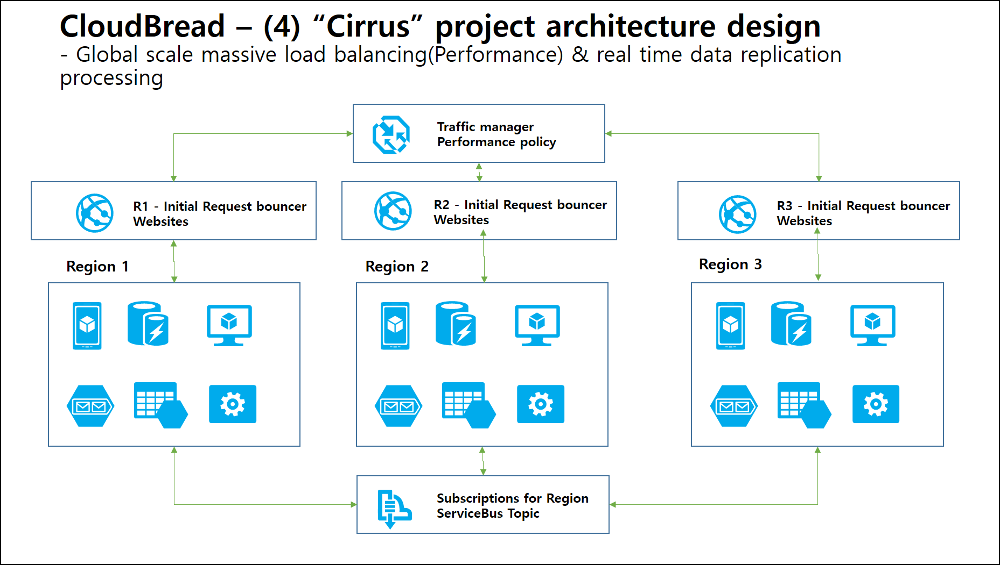
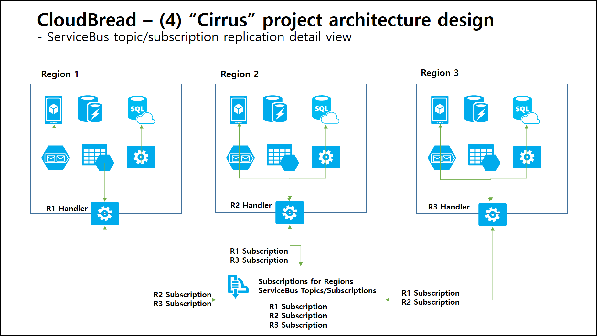
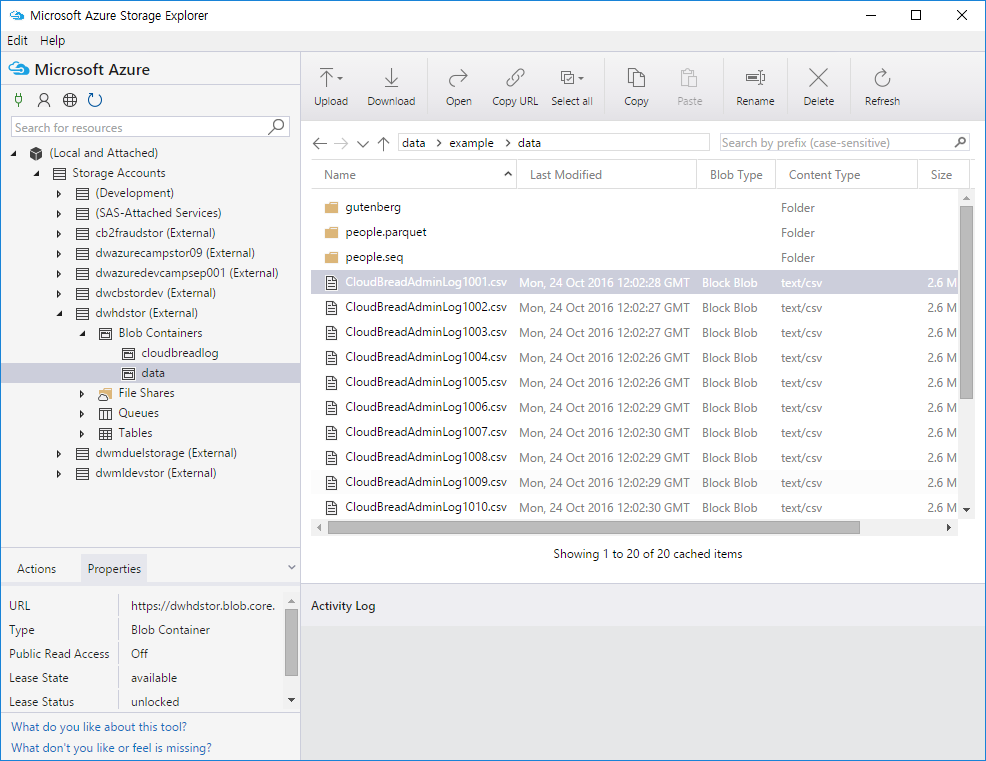
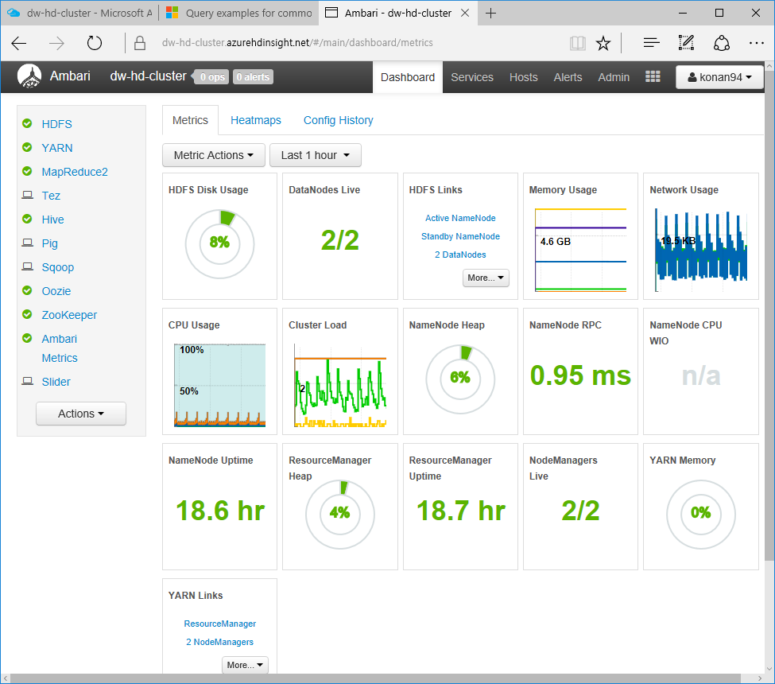
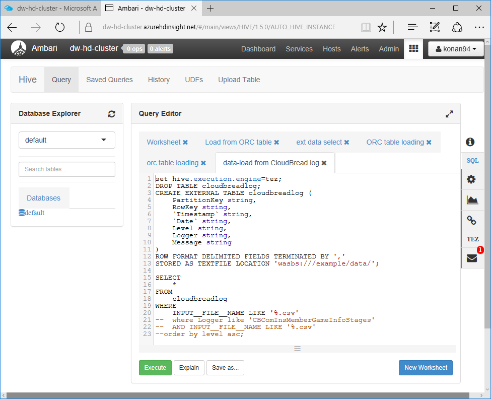
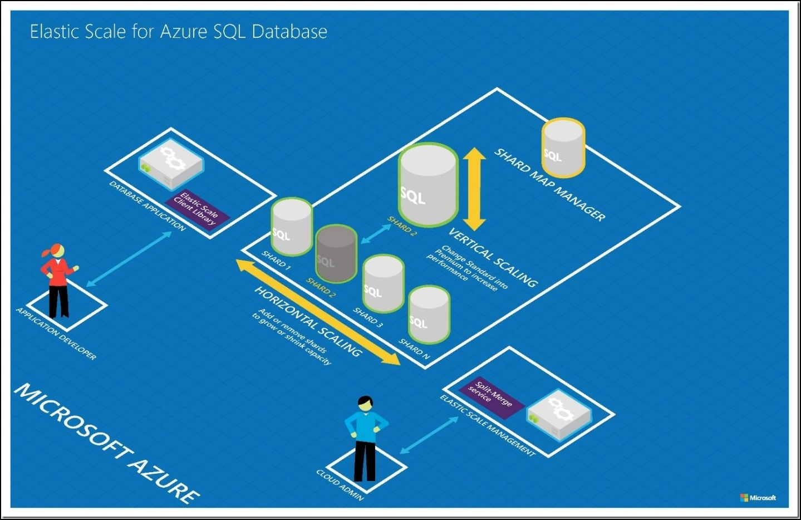
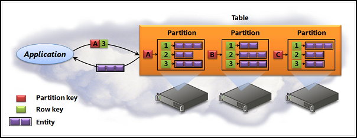
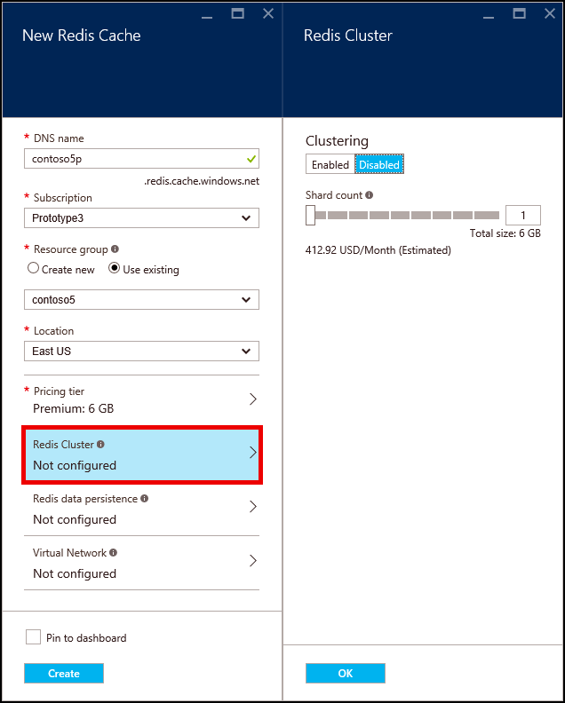

# CloudBread-Doc 프로젝트
이 문서는 CloudBread 프로젝트의 주요기능에 대해 소개하는 Repository

### CloudBread는
클라우드 기반 모바일 게임 서버 플랫폼: MGBaaS  
100% 국산 공개SW 프로젝트인 클라우드브레드(CloudBread)는 클라우드 기반의 오픈소스 프로젝트로서 폭발적인 성장을 하고 있는 모바일 게임을 위한 올인원(all-in-one) 서버 엔진 플랫폼이다.  

모바일 게임을 통해 축적되는 빅데이타인 사용자 행동(패턴) 분석을 중요한 첫 번째 이정표로 목표하고 있으며, 특히 머신러닝(Machine Learning) 엔진을 프로젝트의 중장기적인 차별화 기능중 하나로 개발하고 있다.  

클라우드브레드 프로젝트는 현재 모바일 게임을 위해 최적화된 토탈 서버 엔진과 빅데이타 분석 그리고 이를 통한 머신러닝으로 이어지는 성장 로드맵(roadmap)을 고려하고 있으며, 이런 다양한 공개SW 모듈들이 다양한 타 공개SW 에서도 활용할 수 있도록 공개성이 높은 MIT 라이센스를 채택하고 있다.  

한국의 아틀라시안(Atlassian)을 지향하는 클라우드브레드 프로젝트는 클라우드 환경에서 모바일 게임을 위란 통합 서버 엔진으로서 MGBaaS(Mobile Game Backend as a Service) 플랫폼을 추구한다.  

### CloudBread 프로젝트 공식 웹사이트
CloudBread 프로젝트 : https://github.com/CloudBreadProject  
CloudBread 메인 : https://github.com/CloudBreadProject/CloudBread  
CloudBread 웹사이트 : http://www.cloudbread.org/  
CloudBread 공식 페이스북 그룹 : https://www.facebook.com/groups/cloudBreadProject/  
CloudBread 개발자 가이드wiki(한글) : https://github.com/CloudBreadProject/CloudBread/wiki/Home-kor  
CloudBread 설치 가이드 wiki(한글) : https://github.com/CloudBreadProject/CloudBread/wiki/Install-guide-kor  
CloudBread API 레퍼런스 : http://cloudbreadproject.github.io/  

###1. 모바일 게임을 위한 로직
모바일 게임에 필요한 100여가지의 다양한 behavior 들을 구현해 API를 호출해 즉시 사용가능하도록 로직 구현  
[CloudBread 설치가이드 문서 참조](https://github.com/CloudBreadProject/CloudBread/wiki/Home-kor)  
[CloudBread API 가이드 문서 참조](https://github.com/CloudBreadProject/CloudBread/wiki/CloudBread-behaviors-list)

###2. PaaS 클라우드 기반 게임 서버 (엔진)
CloudBread는 PaaS/DaaS 기반 게임서버로 모바일 게임 개발자(사)가 클라이언트   개발에만 집중할 수 있도록 관리 포인트를 최소화할 수 있음  
[CloudBread 캠프 아키텍처 가이드 문서 참조](https://github.com/CloudBreadProject/CloudBread-Doc/tree/master/camp-docs)

###3. 개발/테스트/배포 통합환경
클라우드 서비스가 제공하는 환경을 모바일 게임 개발사가 더 쉽게 활용 가능하도록 도움  
개발자가 개발/게시/배포 할 경우 익숙한 git/github을 이용 가능하며, node.js로 개발된 Admin-Web이나 Socket 등의 프로젝트도 즉시 App Service로 배포 가능하도록 기본 PaaS의 기능으로 제공  
[CloudBread ARM 배포 Repo](https://github.com/CloudBreadProject/CloudBread-ARM)
[App Service의 git/github 등 통합 배포](https://azure.microsoft.com/ko-kr/documentation/articles/web-sites-deploy//)

###4. 서비스 규모에 따른 클라이언트 게임변경 없음
모바일 게임 클라이언트는 제공되는 API를 호출하면 되며, 무제한에 가까운 클라우드 기반 API 처리 기능을 그대로 활용   가능  
이미 카카오 입점 게임 등의 stress test 등을 진행했으며, 클라우드 PaaS App Service의 scale-up과 scale-out을 활용해 무제한에 가까운 인스턴스를 활용 가능. 지난 Unity United 행사에서 jmetor 및 cloud 기반 성능 테스트 관련 시연을 수행했고, 6000RPS 이상의 처리 성능 기본 제공  
[Unity United 2016 발표자료 성능지표](http://www.slideshare.net/daewkim73/unity-60)

###5. 테스트/개발 가이드
POSTMAN / Github wiki 및 CloudBread 캠프를 통해 제공된 콘텐트를 이용해 게임 백엔드로 구현 가능  
특히, 100여개의 Behavior를 테스트 하기 위해 직접 Rest API를 제작하거나 만들 필요 없이, Postman의 collection을 이용할 수 있어 바로 Camp 등에서도 참여자와 협업 가능한 환경 제공  
[CloudBread wiki 개발 가이드](https://github.com/CloudBreadProject/CloudBread/wiki/Home-kor)


###6. 게임 서버 글로벌 배포
ARM 패키지를 이용해 전세계 원하는 지역의 데이터센터에 손쉬운 배포 가능하도록 자동화된 배포환경 구현  
데이터 센터가 제공되는 어느곳에서나 10분 이내에 모든 CloudBread의 서비스 환경을 배포 가능해 동남아 pre-launching이나 북미 유럽 지역에 최적화된 latency 제공 가능  
[데이터 센터 위치](https://azure.microsoft.com/en-us/regions/)
[CloudBread ARM 프로젝트 Repo](https://github.com/CloudBreadProject/CloudBread-ARM)

###7. 글로벌 동시 배포/트래픽 분산
글로벌 동시 론칭시 게이머가 가까운 데이터센터에 자동 접속할 수 있도록 돕는 환경 구현  
Traffic manager를 이용한 글로벌 론칭 프로젝트 가능  


Traffic manager를 이용하면 사용자로부터 가장 가까운 데이터센터로 request가 요청됨  


백엔드의 데이터 동기화 기술이 어려운 부분이며, 이렇게 ServiceBus Topic을 이용해 replication 수행  
[Traffic Manager 참조문서](https://azure.microsoft.com/en-us/documentation/articles/traffic-manager-overview/)

###8. AES 데이터 암호화
AES256으로 기본 Encryption된 데이터 처리
[CloudBread 개발자 가이드 암호화 참조링크](https://github.com/CloudBreadProject/CloudBread/wiki/Home-kor)
- Crypt 처리로 web.config의 설정을 이용해 AES256 암호화 처리 가능
```
    <!-- Encryption configuration. 암호화 설정-->
    <add key="CloudBreadCryptSetting" value="AES256"></add>
    <add key="CloudBreadCryptKey" value="1234567890123456"></add>
    <add key="CloudBreadCryptIV" value="1234567890123456"></add>
```
- 클라이언트에서 암호화 구성을 수행해 CloudBread API를 호출
- 암호화되어 전달된 텍스트를 CloudBread가 복호화해 서버에 저장
- 암호화 설정시 자동 클라이언트에 암호화된 문자열 response
- **[CloudBread-Encrypt-Text-Tool](https://github.com/CloudBreadProject/CloudBread-Encrypt-Text-Tool)**로 암호화 복호화를 개발시 문자열 테스트 가능
- Postman에 기본 설정된 예제(Encrypt로 시작)를 활용 가능
- DEMO 용도로, "https://cb2-crypt-demo.azurewebsites.net" 서버 이용 가능

###9. 게임 로그 저장
NoSQL 저장소를 활용해 JSON기반 데이터를 향후 목적으로 적재
CloudBread에서의 로그는 기본적으로 Behavior API를 통해 데이터가 변경되는 모든 루틴에서 호출됨
예를 들어, 
[CBComInsMemberItem API](https://github.com/CloudBreadProject/CloudBread/blob/master/Controllers/CBComInsMemberItemController.cs)  
의 경우 아래와 같이 로그를 적재하고 RunLog()를 수행
```
...
// task end log
logMessage.memberID = p.MemberID;
logMessage.Level = "INFO";
logMessage.Logger = "CBComInsMemberItemController";
logMessage.Message = jsonParam;
Logging.RunLog(logMessage);
...
```
RunLog()는 [CBLoggers](https://github.com/CloudBreadProject/CloudBread/blob/master/CBLoggers.cs) 에 implement 되어있고, config에 따라 NoSQL Table Storage 등에 적재 가능  
```
...
switch (globalVal.CloudBreadLoggerSetting)
{
    case "SQL":
        /// Save log on SQL

    case "ATS":
        /// Save log on Azure Table Storage

    case "AQS":
        /// Save log on Azure Queue Storage

    case "redis":
        /// Save log on Azure Redis Cache
        /// yyyymmdd:memberid:Controller:GUID
}
...
```
이렇게 원하는 타입의 분석 성향과 목적에 맞는 NoSQL에 적재 가능하며 기본 NoSQL - Table Storage를 권장  


###10. 기본 관리자 화면
게임 관련 데이터를 관리하는 기본 관리자 화면과 통계 정보를 확인 가능한 화면 제공  
[CloudBread Admin Web Repo 공식](https://github.com/CloudBreadProject/CloudBread-Admin-Web)
[현재 배포 중인 React로 개발된 2.1 project](https://github.com/CloudBreadProject/CloudBread-Admin-Web/tree/2.1.0-LeeJeongYeop)를 아래 링크에서 검토 가능  
```
관리자 페이지 프로젝트(2.1 stable) 
Admin-Web 데모 링크 : https://cb2-admin-demo.azurewebsites.net/  
id : demo@cb2admin.onmicrosoft.com  
pwd : P@ssw0rd!  
```

[CloudBread Admin Web 2.5 - node](https://github.com/CloudBreadProject/CloudBread-Admin-Web/tree/master) 프로젝트를 전체 node.js 로 개발 중  

###11. DAU/HAU/ARPU 통계
일일 사용자 등의 통계 정보를 위의 10번 Admin-Web 프로젝트에서 확인 가능  
통계 데이터를 generate하는 schduler 프로젝트는 [CloudBread-Scheduler](https://github.com/CloudBreadProject/CloudBread-Scheduler) Repo에서 처리  

현재 Schduler를 실행하면 아래의 Slack 채널에 messgae가 도착하도록 구성된 상태  
CloudBread Slack Notification : https://cloudbread.slack.com/messages/general/  
즉, 해당 notification을 받아야 하는 팀원은 slack channel에서 관련 batch 작업이 완료 되는 것을 확인 가능  

설치 및 구성에 대해서는 [CloudBread 설치 가이드 wiki](https://github.com/CloudBreadProject/CloudBread/wiki/Install-guide-kor)의 CloudBread-Scheduler 참조  

###12. 이벤트/쿠폰/선물관리
게임에 필요한 기능 구현 완료  
관리자 페이지에서 모두 처리 가능하며, 클라이언트에서는 Postman 및 [Behavior 리스트 문서](https://github.com/CloudBreadProject/CloudBread/wiki/CloudBread-behaviors-list) 를 참조해 해당 API를 호출 처리  

###13. 로그분석
적재되는 NoSQL기반 로그 데이터를 Big-data Hadoop을 활용해 분석  
CloudBread는 NoSQL인 Table Storage의 분석을 위해 HortonWorks Hadoop PaaS distribution인 HDInsight를 이용해 분석 수행 
[HDInsight 공식 사이트 링크](https://azure.microsoft.com/en-us/services/hdinsight/)  
Table Storage에는 NoSQL로 모든 데이터에 대한 수정 작업을 기록하기 때문에 다양한 시나리오에서 적용 가능하며, 아래 예제는 지난 CloudBread 캠프에서 요청 주셨던 스테이지 레벨(난이도) 디자인 분석 시나리오를 수행  

목표정의 : 30개의 스테이지가 존재하는 캐주얼 게임. 난이도를 적절히 유지하기 위해 해당 스테이지별로 클리어에 소요되는 시간 등을 조회해 스테이지 난이도를 조절하는데 사용하고 싶음. 이를 위해 Closed Beta 서비스를 7일간 진행했고, 7일간 수집된 결과에서 분석을 희망  

기본정보 : 게임의 스테이지 정보는 Member : MemberGameInfoStage 테이블에 1:many relationship으로 정의되어 있음. 이 정보는 RDBMS이기 때문에 state 정보만을 저장해 log성으로 남기지는 않음.  
CloudBread의 API인 CBComInsMemberGameInfoStagesController  저장 처리를 담당하게 되고, 이 루틴에 아래의 log를 남기는 처리가 존재  
```
// task end log
logMessage.memberID = p.MemberID;
logMessage.Level = "INFO";
logMessage.Logger = "CBComInsMemberGameInfoStagesController";
logMessage.Message = jsonParam;
Logging.RunLog(logMessage);
```
즉, 일별 적재되는 로그 데이터에서 CBComInsMemberGameInfoStagesController 식별자를 이용해 Hadoop에서 Hive를 수행하면 원하는 스테이지별 클리어 소요 시간을 계산 가능  

1. HDInsight의 HDFS는 Blob Storage와 호환됨. Blob 처리를 위한 Storage Explorer 개발 도구에서 blob 을 로드. 이 blob들은 *"wasbs:///example/data/"* 하위로 매핑됨

2. 로드된 csv 파일의 구조
PartitionKey|RowKey|Timestamp|Date|Level|Logger|Message
---|---|---|---|---|---|---|
BECA21F0-8B5E-4877-A18A-FD2A4B04322D|4DC0C4A6-893C-4246-AF80-B990EDD10C54|0.011269676|2016-09-10T04:29:50.828Z|stage5|CBComInsMemberGameInfoStages|9
6EDC9E0F-5E7E-4A04-B420-5F3091052CE7|819F7AC7-61E9-40C8-9904-B53B1008311E|0.011269676|2016-06-13T17:40:10.131Z|stage21|CBComInsMemberGameInfoStages|14
9F86454F-4E96-4CAD-A0AE-05DED005774F|766461D9-5FE6-4135-8FB3-15AACE24C4A8|0.011269676|2016-10-18T08:06:05.589Z|stage15|CBComInsMemberGameInfoStages|7
920E72B5-377C-4590-82D5-387ED86EF757|3AB215E0-AAE7-4E69-AF8B-825FADBAF756|0.011269676|2016-06-13T17:38:02.779Z|stage14|CBComInsMemberGameInfoStages|1
Loggers가 CBComInsMemberGameInfoStages 항목들을에 대해 message의 소요 시간(분)을 처리  
Hive 쿼리를 수행하기 위해 HDInsigt Cluster Manager 수행  
  
Hive 쿼리 수행을 준비  
  

3. csv파일들을 Hive에서 External Table로 load 작업 수행  
```
set hive.execution.engine=tez;
DROP TABLE cloudbreadlog;
CREATE EXTERNAL TABLE cloudbreadlog (
	PartitionKey string, 
	RowKey string, 
	`Timestamp` string, 
	`Date` string, 
	Level string, 
	Logger string, 
	Message string
)
ROW FORMAT DELIMITED FIELDS TERMINATED BY ','
STORED AS TEXTFILE LOCATION 'wasbs:///example/data/';
SELECT 
	* 
FROM 
	cloudbreadlog 
WHERE 
	INPUT__FILE__NAME LIKE '%.csv' 
--	where Logger like 'CBComInsMemberGameInfoStages'
--	AND INPUT__FILE__NAME LIKE '%.csv' 
--order by level asc;
```

4. Hive의 External Table로 로드 되었는지 count 체크
```
SELECT count(*) FROM cloudbreadlog;
```

5. 빠른 처리를 위해 Internal Table ORC(Optimized Row Columnar) 테이블로 로드
```
set hive.execution.engine=tez;
CREATE TABLE IF NOT EXISTS CloudBreadStageTime(
	PartitionKey string, 
	RowKey string, 
	`Timestamp` string, 
	`Date` string, 
	Level string, 
	Logger string, 
	Message string
)
STORED AS ORC;
INSERT OVERWRITE TABLE CloudBreadStageTime
SELECT 
	PartitionKey,
	RowKey, 
	`Timestamp`, 
	`Date`, 
	Level, 
	Logger, 
	Message
FROM 
	cloudbreadlog;
```

6. ORC 테이블에서 최종 조회 쿼리 수행
```
select 
	level, 
	avg(cast(Message as int)) as stage_play_avg_min, 
	sum(cast(Message as int)) as stage_play_sum_min 
from CloudBreadStageTime
where Logger = 'CBComInsMemberGameInfoStages'
group by level
order by level asc;
```

7. 수행 결과로 stage별로 수행된 평균 시간과 총합 시간을 조회 가능
이렇게 Hive 쿼리 결과를 얻을 수 있음
level|stage_play_avg_min|stage_play_sum_min
---|---|---|
stage0|7.032447466|22757
stage1|6.923216995|22812
stage10|6.990762125|24216
stage11|6.962710861|23527
stage12|6.99791294|23471
stage13|7.04329525|23426
stage14|7.060240964|24026
stage15|7.005102041|23341
stage16|6.991793313|23003
stage17|6.954984894|23021
stage18|7.089904421|23737
stage19|7.13037037|24065
stage2|7.110673135|23451
...

이 외에도 다양한 여러 시나리오를 도출 가능  
- 주요 아이템들의 사용량 변화 추이(CBAddUseMemberItemController API참조)  
- 사용자의 경험치 또는 Rank를 위한 Point 정보 추적(CBComUdtMemberGameInfoesController API 참조)  
- 현재 게임 내에서 실제 구매되는 주요 아이템의 수량(CBAddMemberItemPurchaseController API 참조)  

등의 다양한 log를 활용한 시나리오를 분석 가능  

###14. Elastic DB – sharded parallel processing
게임 데이터의 증가에 따라 데이터를 병렬로 분산 가능하도록 shard 화 하는 구성구현  
(Microsoft 개발 중이라 보류, Elastic Scale for Azure SQL Database)  
CloudBread의 Admin-Web은 node.js 기반이기 때문에, node.js에서 Elastic DB에 접근하기 위한 NPM package 등이 추가로 필요  
  
참고링크 : [Get started with Elastic Database tools](https://azure.microsoft.com/en-us/documentation/articles/sql-database-elastic-scale-get-started/)

###15. NoSQL sharded Table storage
로그가 적재되는 NoSQL 테이블 저장소에 대해 병렬로 데이터 적재/조회가 가능하도록 구현
PaaS로 제공되는 NoSQL Key/Value 저장소인 Table Storage를 활용해 병렬 분산 적재 수행
  
Logical한 하나의 테이블이나 내부적으로 PartitionKey를 조절해 해당 Entity를 물리적으로 다른 하드웨어의 Storage에 저장하는 구조로 처리  

###16. redis cluster service 
게임 데이터에 대해 In-Memory 기반 KV NoSQL 저장소인 redis 캐시 서비스의 안정성과 성능을 위한 클러스터 기능 구현 추가  
CloudBread는 redis cache를 Ranking 서비스와 로그 저장소로 사용 가능.  
[CloudBread - CBRedis](https://github.com/CloudBreadProject/CloudBread/blob/master/CBRedis.cs) 처리에서 redis 처리가 이루어짐.  
```
public static bool SetSortedSetRank(string sid, double point)
{
    ConnectionMultiplexer connection = ConnectionMultiplexer.Connect(redisConnectionStringRank);

    try
    {
        IDatabase cache = connection.GetDatabase(1);
        cache.SortedSetAdd(globalVal.CloudBreadRankSortedSet, sid, point);
    }
    catch (Exception)
    {
        throw;
    }
    return true;
}
```
Redis 라이브러리들을 이용해 API front-end에서 처리가 진행되고, [CBRankController](https://github.com/CloudBreadProject/CloudBread/blob/master/Controllers/CBRankController.cs) 에서 API에 대해 응답 처리 수행  
CloudBread에서 이런 redis 처리의 안정성을 위해 Clustering 기능을 적용했으며, 기본 Cluster의 redis로 접근하면 추가 작업없이 위의 API들을 모두 활용 가능하고 최대 10개의 shard를 구성 가능  
  

###17. NoSQL Table Storage–to- Hadoop
NoSQL에 적재된 데이터를 Big   data 분석을 위해 Hadoop으로 적재하는 기능 구현  
(게임 데이터의 성격에 따라 달라짐. 내용 참조) 13번 로그분석에서 전체 분석을 Hadoop을 이용해 수행하는 절차를 진행 완료.

###18. Stream Analytics API
실시간 Machine Learning 분석 기법을 위해 API를 구현/Machine 
Learning API와 통신하기 위한 환경 구성
(CloudBread 에서 Stream Analytics 를 통하지 않고 즉시 비동기로 Machine Learning API를 호출 가능하도록 구성)
최초 Machine Learning을 호출하기 위해 가이드 되는 방안으로, 기존 R에서 제공하는 여러 라이브러리들을 활용해 구축하는 방안에 대해 CloudBread ontributor 팀내부에서 협의 진행.  
여러 조사를 하던 과정에서 최선의 real-time Machine Learning 예측 분석 방안을 고려했으나, Azure Machine Learning이 발표되고, 예측 모델(Predictive Model)을 클라우드 PaaS 기반으로 노출, 손쉽게 사용 가능한 방안을 제공.  
이에 CloudBread Front-end에서 즉각적으로 Machine Learning으로의 호출이 가능해졌으며 Stream Analytics는 실시간 라이브 스트팀 데이터내의 Fraud Detection에서 활용.  
**Stream Analytics API 적용 부분은 아래 Fraud Detection 기능 소개에서 함께 수행**

참조링크 :  
CloudBread의 고객 이탈 예측(Game user churn prediction) real-time prediction & Batch prediction   
CloudBread의 게임내 아이템 추천(In-game item suggestion) real-time prediction & Batch prediction  

###19. Data Factory
Hadoop 에서 data pre-processing 및 automated data pipelining  
을 위한 data factory 서비스 구축(게임 데이터의 성격에 따라 다르며, 필요성이 낮음)  
big data 분석에서 ETL 도구로 사용되며, CloudBread의 경우 log 분석에 필요한 Hadoop인 HDInsight를 Data Factory 내에서 자동으로 provision/batch수행/결과를 다시 ETL에 올려 수행 과정을 활용 가능.  

###20. Machine Learning algorithm
Machine Learning에서 데이터를 활용해 예측 분석 서비스가   가능하도록 학습시키기 위한 알고리듬 및 Machine Learning workflow 를 구현  

CloudBread Game User Chrun 공개 Machine Learning model
http://gallery.cortanaintelligence.com/Experiment/CloudBread-game-user-churn-prediction-1

CloudBread game item suggestion prediction 공개 Machine Learning model
http://gallery.cortanaintelligence.com/Experiment/CloudBread-game-item-suggestion-prediction-1

위의 모델은 모두 공개한 CloudBread Machine Learning의 분석 모델  

목표 정의 :  
이 분석모델을 활용해 예측모델(Predict model)을 구축하고 CloudBread를 통해 실시간 예측을 수행하는 것이 목표.

1. CloudBread Machine Learning 모델을 생성하거나, 위의 gallery에서 복제
2. 모델을 실행하고, 수행된 예측 결과 확인
3. Predictive model로 생성 후 API Web Service로 배포
4. 생성된 Web service의 API Key를 이용해 CloudBread에서 real-time predict 수행
```
public class UserChurnController : ApiController  
{
    // POST api/UserChurn
    public HttpResponseMessage POST(CBChurn p)
    {
        // call ML function
        InvokeRequestResponseService(p).Wait();
        ...
    }
    static async Task InvokeRequestResponseService(CBChurn p)
    {
        ...
        const string apiKey = "APIKey"; // Replace this with the API key for the web service
        client.DefaultRequestHeaders.Authorization = new AuthenticationHeaderValue("Bearer", apiKey);
        client.BaseAddress = new Uri("Machine-Learning-Web-Service-URL");
        HttpResponseMessage response = await client.PostAsJsonAsync("", scoreRequest).ConfigureAwait(false);
        if (response.IsSuccessStatusCode)
        {
            string result = await response.Content.ReadAsStringAsync();
            Debug.WriteLine("Result: {0}", result);
            p.ChurnYN = result;
        }
        ...
    }
}
```
5. Machine Learning API Controller를 publish 하고, Postman에서 테스트 수행해 real-time prediction 수행

6. Batch 분석 수행  
Batch 작업을 수행하기 위해서 Machine Learning Batch execution이 제공하는 코드 이용이 가능.  
추가적으로, Excel을 이용해 Batch 분석도 가능  

7. In-game에서 게이머의 패턴과 특성을 취합해 학습 시킨 후 적절한 유료 아이템을 추천하는 시나리오 역시 게임 서비스에서 매우 중요한 매출과 직결되는 예측 분석  
관련해 CloudBread는 predict model로 in-game item suggestion을 제공  
Postman 및 소스코드 참조  

###Big data - Business Intelligence 플랫폼
Hadoop에서 데이터를 visualize 시키기 위한 Business Intelligence 
플랫폼 제공

###22. Big data - Business Intelligence 웹사이트
Hadoop 데이터 분석 결과를 Web으로 display 시키기 위한 웹사이트 구축

###23. Stream analytics pre-processing API
실시간 분석을 위해 F/E로 접근하는 데이터를 stream 분석이 가능한 플랫폼에 올려 Stream Analytics로 실시간 분석하기 위해 로드하는 API를 구성하고, aggregation을 통해 실시간 분석이 가능한 데이터로 pre-processing 수행

###24. Stream analytics real-time analytics API
Stream Analytics에서 Fraud Detection이 가능하도록 구성  
목표 : Stream Analytics에서 실시간으로 purchase API에 5초에 5회 이상 접속하는 어뷰징 사용자를 실시간으로 검출 수행  
1. 일반적으로 요청하는 Normal-Device를 simulate하는 어플리케이션 수행
2. 5초에 50여회 이상 요청하는 Fraud-Device를 simulate 하는 어플리케이션 수행
```
while (i <= 50)
{
    int level = rand.Next(0, 100);
    int points = rand.Next(0, 50);
    int winnerYN = 0;

    var telemetryDataPoint = new
    {
        deviceId = "cb2-fraud-device",
        DateTime.Now,
        level,
        points,
        winnerYN
        //prediction
    };
    var messageString = JsonConvert.SerializeObject(telemetryDataPoint);
    var message = new Message(Encoding.ASCII.GetBytes(messageString));

    await deviceClient.SendEventAsync(message);
    Console.WriteLine("{0} > Sending message: {1}", DateTime.Now, messageString);

    Task.Delay(1).Wait();	// delay 없이 바로 다음 loop 수행해 fraud device 시뮬레이션
    i++;
}
```
EventHub 쪽으로 두개의 디바이스가 데이터를 push 하는 시뮬레이션 수행  

Stream Anlytics에서 input을 통해 stream data를 가져와 처리  
쿼리는 5초 이내에 5회 이상 요청이 들어온 경우 abuse로 판단해, 이 데이터를 fraudoutput blob 저장소로 출력 수행.
```
SELECT
    *
INTO
    output
FROM
    input TIMESTAMP BY Now
SELECT
    deviceid, System.TimeStamp AS Now,
    COUNT(*) AS [Count]
INTO
    fraudoutput
FROM
    input TIMESTAMP BY Now
GROUP BY
    deviceid, 
    TumblingWindow(second, 5)
HAVING
    [Count] >= 5
```

Stream Analytics를 실행하고, fraud device를 수행한 후, fraudoutput을 확인  
필요할 경우 추가적인 event를 발생하거나 web hook을 보내 slack 등으로 메세지를 보내는 처리도 가능  

###25. Real-time Machine Learning workflow + API
Real-time 분석을 위해 Stream Analytics와 Machine Learning 을 연계하기 위해 API 소비를 위한 function 개발  (CloudBread 에서 Stream Analytics 를 통하지 않고 즉시 비동기로 Machine Learning API를 호출 가능하도록 구성)

###26. Real-time Business Intelligence 플랫폼
데이터를 visualize 시키기 위한 Business Intelligence 플랫폼 제공

###27. Real-time Business Intelligence 웹사이트
Real Time 분석 결과를 Web으로 display 시키기 위한 웹사이트 구축


